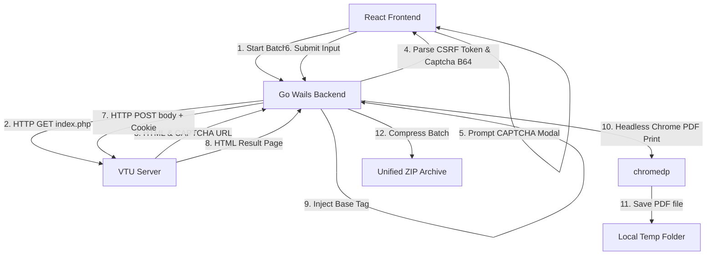

# 🎓 VTU Desktop Result Scraper

> **High-Performance Frameless Desktop Batch PDF Scraper & Archiver built for the AcaTrack ecosystem.**  
> Automatically crawl student results, solve CAPTCHAs interactively, and export styled, print-ready A4 PDFs packaged into a unified `.zip` archive.

---

## 🌟 Key Features

*   **True Frameless UI:** Sleek, modern dark mode window styling featuring custom macOS-style traffic light window controls and integrated dragging regions (`--wails-draggable: drag`).
*   **Custom Select Dropdowns:** Custom React Semester dropdown list that bypasses Linux WebKit system menu overrides, completely eliminating default stark-white popovers in favor of unified `#16161f` styling.
*   **AcaTrack-Aligned Auto-Calculation:** Input a standard USN Prefix (e.g. `1JS22CS`) and select a Semester (1 to 8). The frontend automatically computes VTU’s internal server folder names (e.g., `DJcbcs24` or `JJEcbcs24`) using the exact semester logic rules as your core web portal.
*   **CSRF & CAPTCHA Bypassing:** Performs host-relative CAPTCHA pathing and dynamic `<input type="hidden" name="Token" ...>` CSRF token extraction in a single-pass HTML traversal to bypass portal protection.
*   **Pixel-Perfect A4 Prints:** Decoupled `RenderHTMLToPDF` headless browser workflow that injects dynamic `<base href="...">` tags to force correct styling, fonts, and bootstrap tables—making the output immediately digestible by your Rust-based PDF parser.
*   **Dual-Mode Flow:** Prompts the user with clear interactive CAPTCHA modals for active students, with simple "Skip USN" fallback options.
*   **Robust Archiving:** Encapsulates all successfully captured USN PDFs into a compressed ZIP file with local native Save Dialogs.

---

## 🛠️ Architecture Workflow

The diagram below outlines the runtime lifecycle of a scraping batch:



---

## 🚀 Download Ready-to-Run Binaries

No compilers or runtimes required! The repository utilizes a modern **GitHub Actions CI/CD Pipeline** running on **Node 24** to build and release standalone packages:

1. Head over to the **[Releases](https://github.com/chetanuchiha16/result-scraper/releases)** tab in this repository.
2. Download the compressed executable for your operating system:
    *   **Windows:** `vtu-result-scraper-windows-amd64.zip` (standalone `.exe`)
    *   **Linux:** `vtu-result-scraper-linux-amd64.tar.gz` (standalone executable)

---

## 💻 Local Development

### 1. Prerequisites
Ensure you have the following installed on your machine:
*   **Go:** `1.23` or higher
*   **Node.js:** `20.x` or higher & `npm`
*   **Wails CLI:** `go install github.com/wailsapp/wails/v2/cmd/wails@latest`

### 2. System Dependencies (Linux-only)
Modern Linux distributions (such as Ubuntu 24.04+ or Fedora) require WebKitGTK 4.1 headers:
```bash
# Debian / Ubuntu:
sudo apt-get install -y libgtk-3-dev libwebkit2gtk-4.1-dev build-essential

# Fedora / RedHat:
sudo dnf install -y gtk3-devel webkit2gtk4.1-devel gcc-c++
```

### 3. Running Dev Mode
Wails provides a Vite dev server with seamless hot-reloads.
> **Note for Fedora/Wayland users:** To avoid GPU-compositor network conflicts under Linux WebKit, always run under the X11 server backend:

```bash
export GDK_BACKEND=x11
wails dev -tags webkit2_41
```

---

## 📦 Compiling Production Builds

To compile compressed, standalone production binaries for distribution, use the following platform-specific commands:

#### Compile for Windows:
```bash
wails build -platform windows/amd64 -clean
```
*(Produces a standalone `build/bin/result-scraper.exe`)*

#### Compile for Linux:
```bash
wails build -platform linux/amd64 -tags webkit2_41 -clean
```
*(Produces a standalone `build/bin/result-scraper` binary linking to WebKitGTK 4.1)*
